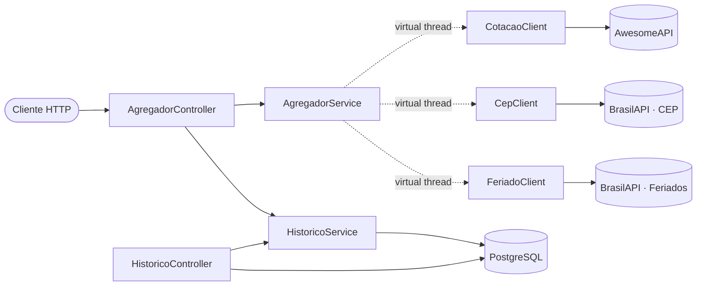

# investe-api

Agregador de dados públicos brasileiros (cotações de moedas, CEP, feriados
nacionais) — projeto de portfólio em **Java 25 / Spring Boot 4.1**, focado em
mostrar features modernas da linguagem aplicadas a um problema real: consultar
várias APIs externas em paralelo, com tratamento de erro e timeout, sem
quebrar a aplicação, e guardar um histórico consultável dessas chamadas.

Fontes usadas (públicas, sem autenticação):
- [AwesomeAPI](https://economia.awesomeapi.com.br) — cotações de moedas
- [BrasilAPI](https://brasilapi.com.br) — CEP e feriados nacionais

## Stack

Java 25 · Spring Boot 4.1 · Maven (wrapper) · PostgreSQL + Flyway ·
JUnit 5 + AssertJ + Testcontainers + WireMock · Docker Compose ·
GitHub Actions

## Arquitetura



Cada fonte externa segue o mesmo formato de pacote — `cotacao/`, `cep/`,
`feriado/` — com três peças: um `record` que espelha o JSON bruto da API
(`*Bruta`), um `record` de configuração (`*ApiProperties`) e um `*Client` que
faz a chamada HTTP e nunca deixa uma exceção escapar.

| Pacote | Responsabilidade |
|---|---|
| `core` | `Resultado` (o tipo central do projeto), `StatusConsulta`, cache, métricas, OpenAPI |
| `cotacao` / `cep` / `feriado` | Um cliente HTTP por fonte externa |
| `agregador` | Consulta as 3 fontes em paralelo e monta a resposta combinada |
| `historico` | Persistência das consultas e o endpoint de tendência |

### O padrão central: `Resultado`

Toda chamada a uma fonte externa devolve `Resultado<T>` — nunca lança
exceção, nunca retorna `null`:

```java
public sealed interface Resultado<T> permits Resultado.Sucesso, Resultado.Falha, Resultado.Timeout {
    record Sucesso<T>(T dado) implements Resultado<T> {}
    record Falha<T>(String mensagem, int statusCode) implements Resultado<T> {}
    record Timeout<T>(String mensagem) implements Resultado<T> {}
}
```

Esse tipo aparece em praticamente todo o projeto: nos 3 clients, no
`AgregadorService`, na conversão pra HTTP (`CotacaoController`), na conversão
pro histórico persistido (`StatusConsulta.de(...)`) e nas métricas.

## Como rodar

**Pré-requisitos:** JDK 25 e Docker (Docker Desktop rodando).

```bash
git clone https://github.com/Neemiasbragadev/investe-api.git
cd investe-api
./mvnw spring-boot:run
```

O Spring Boot detecta o `compose.yaml` sozinho (via `spring-boot-docker-compose`)
e sobe o PostgreSQL automaticamente — não precisa rodar `docker compose up`
à parte.

| Método | Endpoint | Descrição |
|---|---|---|
| GET | `/api/cotacoes/{par}` | Cotação de uma moeda, ex. `USD-BRL` |
| GET | `/api/agregado?par=&cep=&ano=` | Cotação + CEP + feriados, em paralelo |
| GET | `/api/historico?limite=` | Últimas consultas registradas |
| GET | `/api/historico/ultimo` | Consulta mais recente |
| GET | `/api/historico/tendencia?janela=` | Média móvel da duração das consultas |
| GET | `/swagger-ui.html` | Documentação interativa (OpenAPI) |
| GET | `/actuator/health` | Health check |
| GET | `/actuator/prometheus` | Métricas no formato Prometheus |

## Decisões técnicas

**Spring Data JPA, não Spring Data JDBC.** É o padrão mais pedido no
mercado — troca consciente: a entidade `HistoricoConsulta` não pode ser um
`record` porque o Hibernate exige uma classe mutável com construtor vazio
(proxies, lazy loading). É a única classe do projeto que não é um record.

**`RestClient`, não `RestTemplate` nem `WebClient`.** `RestTemplate` está em
manutenção; `WebClient` traz a complexidade do modelo reativo (Mono/Flux)
sem necessidade aqui, já que virtual threads já resolvem o paralelismo de
forma síncrona. `RestClient` é o cliente HTTP síncrono moderno do Spring —
API fluente, fácil de configurar com timeout, sem reatividade desnecessária.

**Cache só em CEP e feriados, nunca em cotação.** CEP e feriados são dados
que não mudam; cotação muda a cada segundo — cachear câmbio destruiria o
motivo da API existir. O `unless` do `@Cacheable` garante que só respostas
`Sucesso` entram em cache: uma falha nunca fica "presa" reportando erro
depois que o provedor externo já voltou a funcionar.

**Problem Details (RFC 9457) para os erros.** Em vez de cada endpoint
inventar seu próprio formato de erro, toda resposta de erro (tanto a
tratada manualmente no `CotacaoController` quanto qualquer erro que o
Spring MVC já trata sozinho — 404, parâmetro inválido) segue o mesmo
formato padronizado (`type`, `title`, `status`, `detail`, `instance`).

**Testcontainers em todo teste que toca banco.** Nenhum teste usa H2 ou um
banco "aproximado" — sempre PostgreSQL real via Testcontainers, porque as
migrations Flyway e os tipos de coluna precisam ser validados contra o
banco de verdade, não uma simulação.

## Por que usei cada feature do Java moderno

### Records

DTOs imutáveis sem boilerplate: `record Sucesso<T>(T dado) {}` já gera
construtor, `equals`/`hashCode`/`toString` e getters — o jeito antigo seria
uma classe com ~20 linhas repetitivas (ou Lombok como muleta). Usados em
todos os DTOs de resposta externa, no `Resultado`, e até em configuração
(`CotacaoApiProperties` etc., ligados direto do `application.properties`
via `@ConfigurationProperties`).

### Sealed interfaces + pattern matching no `switch`

`Resultado` só pode ser `Sucesso`, `Falha` ou `Timeout` — o compilador
conhece as três variantes (`permits`), então o `switch` que as consome não
precisa de `default`: se uma quarta variante for adicionada, todo `switch`
que não foi atualizado quebra o build. Reaproveitado em três lugares
diferentes: `CotacaoController` (monta a resposta HTTP), `StatusConsulta.de`
(converte pro histórico) e nas métricas. Do jeito antigo, isso seria
exceções customizadas + `try/catch` em cascata, sem essa garantia do
compilador.

### Virtual threads

Ver a seção de benchmark abaixo — é o paralelismo das 3 fontes no
`AgregadorService`.

### Sequenced Collections

`getFirst()`/`.reversed()` em vez de `lista.get(0)` ou um laço manual
invertendo a lista — funciona em qualquer `List`, sem depender da
implementação concreta. Usado em `HistoricoController.ultimo()` (pega a
consulta mais recente) e em `HistoricoService.calcularTendencia` (inverte a
ordem pra cronológica antes de calcular a média móvel).

### Stream Gatherers

`GET /api/historico/tendencia` calcula a média móvel da duração das
consultas usando `stream.gather(Gatherers.windowSliding(n))` — agrupa o
stream em janelas deslizantes sobrepostas de tamanho `n`. É uma feature
estável desde o JDK 24 (JEP 485) que permite criar operações de stream
customizadas além de `map`/`filter`/`reduce`. Antes disso, uma média móvel
exigia um laço manual com uma `Deque` fazendo o buffer da janela na mão.

```java
List<PontoTendencia> calcularTendencia(int tamanhoJanela) {
    return historico.stream()
            .map(HistoricoConsulta::getDuracaoMs)
            .gather(Gatherers.windowSliding(tamanhoJanela))
            .map(janela -> new PontoTendencia(media(janela)))
            .toList();
}
```

### Scoped Values — por que não usei

O roteiro original deixava essa feature condicional ("se houver
necessidade de propagar contexto"). As 3 chamadas paralelas do
`AgregadorService` são independentes entre si — nenhuma precisa saber de um
correlation-id ou qualquer contexto vindo de fora. Forçar `ScopedValue` sem
essa necessidade real seria complexidade sem propósito; prefiro documentar
o motivo de não usar do que inventar uma necessidade artificial só para
"marcar a feature".

### Structured Concurrency — fora de escopo

Ainda é preview no JDK 25 e o próprio roteiro já marcava como opcional, em
branch separada, para comparar com a abordagem de virtual threads usada
aqui. Não fiz essa branch neste momento.

## Paralelismo: sequencial vs paralelo (virtual threads)

O endpoint `GET /api/agregado?par=USD-BRL&cep=01310930&ano=2026` consulta
3 fontes externas independentes (AwesomeAPI, BrasilAPI CEP, BrasilAPI
feriados). `AgregadorService` tem duas implementações:

- `buscarSequencial` — chama as 3 fontes uma atrás da outra.
- `buscarParalelo` — dispara as 3 chamadas ao mesmo tempo, cada uma numa
  **virtual thread** (`Executors.newVirtualThreadPerTaskExecutor()`), usada
  em produção.

Medido em `AgregadorBenchmarkTest` (WireMock simulando 300ms de latência
igual nas 3 fontes, para o número ser determinístico):

| Estratégia | Tempo |
|---|---|
| Sequencial | ~1196 ms |
| Paralelo (virtual threads) | ~308 ms |

O sequencial fica perto da **soma** das 3 latências (3 × 300ms); o paralelo
fica perto do **maior** tempo individual (300ms) — quase 4x mais rápido com
apenas 3 fontes, e a diferença cresce com mais fontes.

### Por que virtual threads, e não `CompletableFuture` com pool fixo?

Sem virtual threads, para paralelizar 3 chamadas HTTP bloqueantes sem travar
uma thread do SO por chamada, seria preciso `CompletableFuture.supplyAsync`
com um `ExecutorService` de tamanho ajustado à mão (ou migrar para
`WebClient` reativo). Virtual threads deixam escrever o código do jeito
síncrono/óbvio — `future.get()` bloqueando mesmo — e a JVM cuida de não
desperdiçar threads do sistema operacional: cada virtual thread bloqueada
custa quase nada.

Vale notar que isso é diferente do `spring.threads.virtual.enabled=true`
(configurado desde a Fase 1): aquele faz o Tomcat atender cada **requisição
HTTP recebida** numa virtual thread. O executor do `AgregadorService` é
outro uso da mesma feature, para paralelizar as chamadas de **saída** dentro
de uma única requisição.

## Testes

- **Unitários** — cada `*Client` tem sucesso/falha/timeout simulados com
  WireMock (`CotacaoClientTest`, `CepClientTest`, `FeriadoClientTest`);
  `HistoricoService` e `MetricasFontes` testados isoladamente com Mockito.
- **Fatiados (`@WebMvcTest`)** — `CotacaoControllerTest`,
  `AgregadorControllerTest`, `HistoricoControllerTest`: camada web sozinha,
  dependências mockadas.
- **Cache** — `CepClientCacheTest` confere com o proxy real do Spring que a
  segunda chamada não bate na API externa, e que falha nunca é cacheada.
- **Persistência** — `HistoricoConsultaRepositoryTest` roda a migration
  Flyway contra um PostgreSQL real via Testcontainers.
- **Integração completa** — `AgregadorIntegrationTest` sobe o contexto
  Spring inteiro (Postgres real + as 3 fontes simuladas via WireMock com
  sucesso, falha e timeout ao mesmo tempo), chama `/api/agregado` de
  verdade por HTTP e confere que o histórico gravado bate com a resposta.

Pipeline de CI (`.github/workflows/ci.yml`) roda `./mvnw verify` a cada
push/PR no GitHub Actions.
